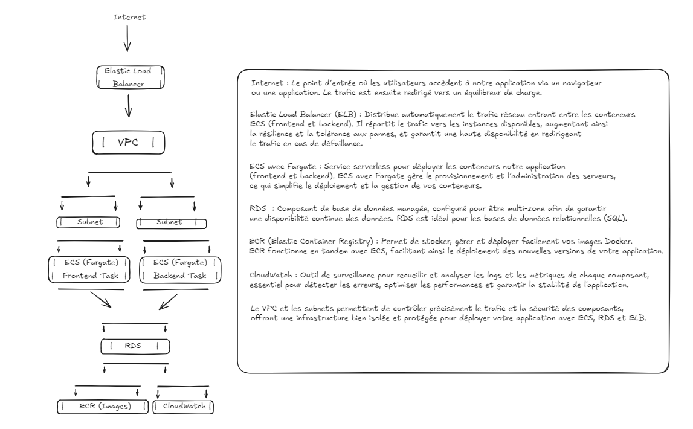

Le service AWS utilisé sera Amazon ECS pour managé de manière plus facile et laisser Amazon gérer les parties plus compliquées. ECS permet de déployer, gérer et faire évoluer des conteneurs. Avec Fargate, on n’a pas besoin de gérer directement les serveurs, car AWS s'occupe de cette partie, ce qui simplifie la gestion de l'infrastructure.

Les composants AWS nécessaires vont être un VPC, un cluster via Fargate qui contiendra une task definition et un service.

Le VPC (Virtual Private Cloud) est un réseau virtuel dédié dans AWS, où on peut contrôler qui peut accéder aux ressources, les isoler si besoin, et gérer les sous-réseaux, routes, et connexions pour sécuriser l’application.

Le cluster regroupe toutes les ressources et tâches liées à ECS. Il permet de gérer l'organisation des conteneurs qu’on déploie.

La task definition est comme un modèle pour décrire les conteneurs à exécuter (images de conteneurs, mémoire, CPU, variables d'environnement, etc.). Elle est réutilisée pour créer des tâches ou services dans le cluster.

Le service dans ECS garantit que le nombre de tâches définies est toujours en cours d'exécution, et permet de gérer la scalabilité et la haute disponibilité des conteneurs.

Il faudra aussi un NAT Gateway pour permettre à des personnes extérieures d'accéder à l'appli. La NAT Gateway donne aussi aux ressources en sous-réseaux privés la possibilité de se connecter à Internet pour les mises à jour, tout en les gardant protégées des connexions non autorisées venant de l’extérieur.

Un Application Load Balancer sera aussi présent pour pouvoir rediriger le trafic sur l'appli en cas de besoin et avoir accès à plusieurs availability zones, permettant ainsi de s'étendre dans d'autres zones par sécurité. Le load balancer répartit le trafic entrant entre les conteneurs et, en s’appuyant sur plusieurs zones de disponibilité, il renforce la résilience en cas de panne dans une région.

L'utilisation d'un sous-réseaux sera aussi utile pour en avoir un par availability zone. Diviser le VPC en sous-réseaux permet d'organiser et d’isoler les ressources, et chaque sous-réseau peut gérer le trafic d’une availability zone spécifique, ce qui assure une meilleure redondance.

Enfin, il faudra ajouter un security groups pour la sécurité. Les security groups agissent comme un pare-feu en définissant les règles de trafic autorisé, entrant et sortant, pour protéger l’application des accès indésirables.

